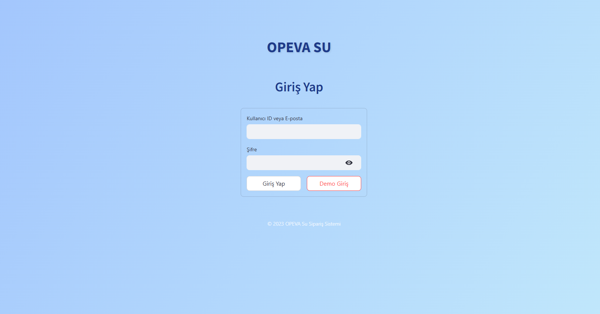
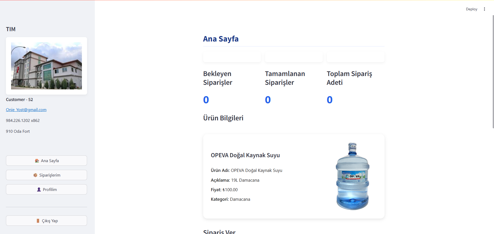
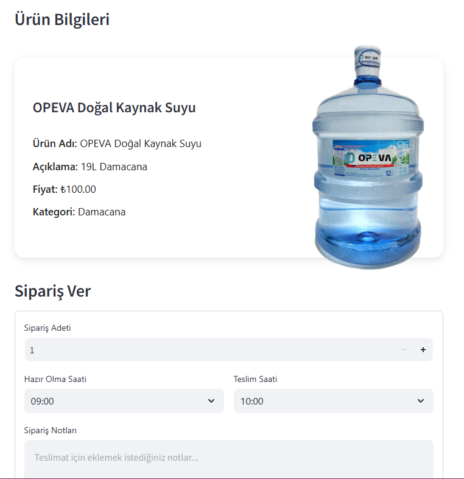
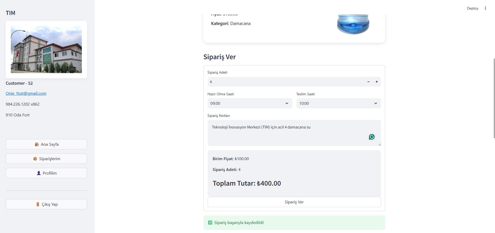
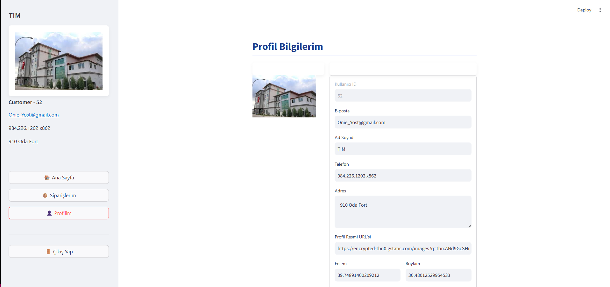
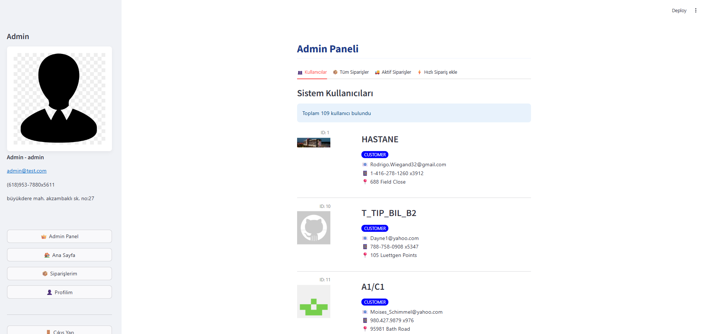
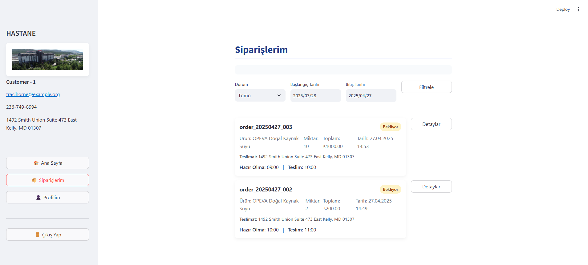

# MongoDB Tabanlı Sipariş Yönetim Uygulaması

Bu uygulama, MongoDB veritabanı kullanarak kimlik doğrulama ve sipariş yönetimi işlemlerini gerçekleştiren bir Streamlit web uygulamasıdır.

## Özellikler

- Kullanıcı kimlik doğrulama (MongoDB users koleksiyonu ile)
- Sipariş oluşturma ve kaydetme
- Tarih ve saat seçimi

## Kurulum

1. Gerekli kütüphaneleri yükleyin:

```bash
pip install -r requirements.txt
```

2. MongoDB'nin kurulu ve çalışıyor olduğundan emin olun.

3. Örnek veritabanını kurun:

```bash
python setup_db.py
```

4. Uygulamayı çalıştırın:

```bash
streamlit run app.py
```

## Kullanım

- Giriş sayfasında kullanıcı ID'nizi girin (örn. "user1", "user2" veya "admin")
- Şifre alanına "123" yazın
- Giriş yaptıktan sonra sipariş adetini ve tarih/saati seçerek yeni sipariş oluşturabilirsiniz

## Veritabanı Yapısı

- **users**: Kullanıcı bilgilerini içeren koleksiyon
- **orders**: Sipariş bilgilerini içeren koleksiyon

## Geliştirme Notları

- Bu uygulama demonstrasyon amaçlıdır ve gerçek ortamda kullanılmadan önce güvenlik iyileştirmeleri yapılmalıdır
- Şifre doğrulaması şu anda basit bir kontrol ile yapılmaktadır, gerçek uygulamalarda hash ve tuz kullanılmalıdır

## Uygulama Görselleri 


<h2>Uygulama Görselleri</h2>

<div style="display: flex; flex-wrap: wrap; gap: 16px; justify-content: start;">
  <div style="flex: 0 0 48%;">
    
    <p style="text-align:center; font-size:14px;">Giriş Sayfası</p>
  </div>
  <div style="flex: 0 0 48%;">
    
    <p style="text-align:center; font-size:14px;">Ana Sayfa</p>
  </div>
  <div style="flex: 0 0 48%;">
    
    <p style="text-align:center; font-size:14px;">Sipariş Oluşturma</p>
  </div>
  <div style="flex: 0 0 48%;">
    
    <p style="text-align:center; font-size:14px;">Sipariş Oluşturma 2</p>
  </div>
  <div style="flex: 0 0 48%;">
    
    <p style="text-align:center; font-size:14px;">Profil Bilgileri</p>
  </div>
</div>

<h3>Admin Sayfaları</h3>

<div style="display: flex; flex-wrap: wrap; gap: 16px; justify-content: start;">
  <div style="flex: 0 0 48%;">
    
    <p style="text-align:center; font-size:14px;">Admin Sayfası</p>
  </div>
  <div style="flex: 0 0 48%;">
    
    <p style="text-align:center; font-size:14px;">Kullanıcı Listesi</p>
  </div>
  <div style="flex: 0 0 48%;">
    
    <p style="text-align:center; font-size:14px;">Sipariş Listesi</p>
  </div>
</div>


## Katkıda Bulunanlar

