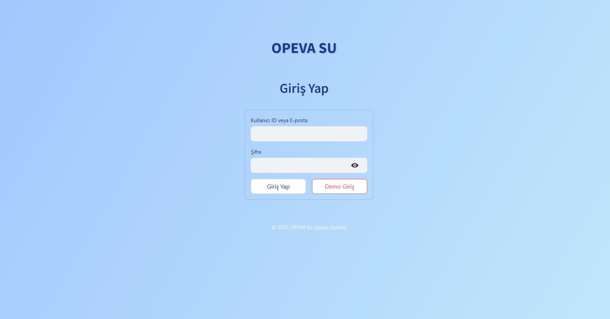
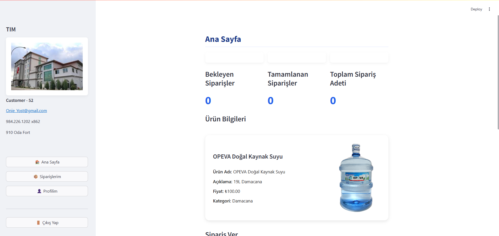
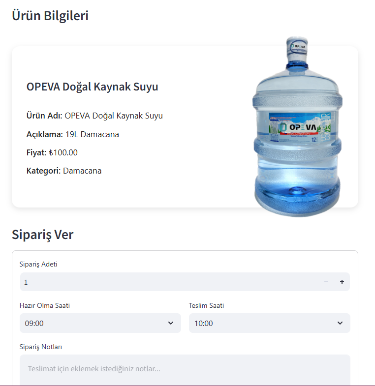
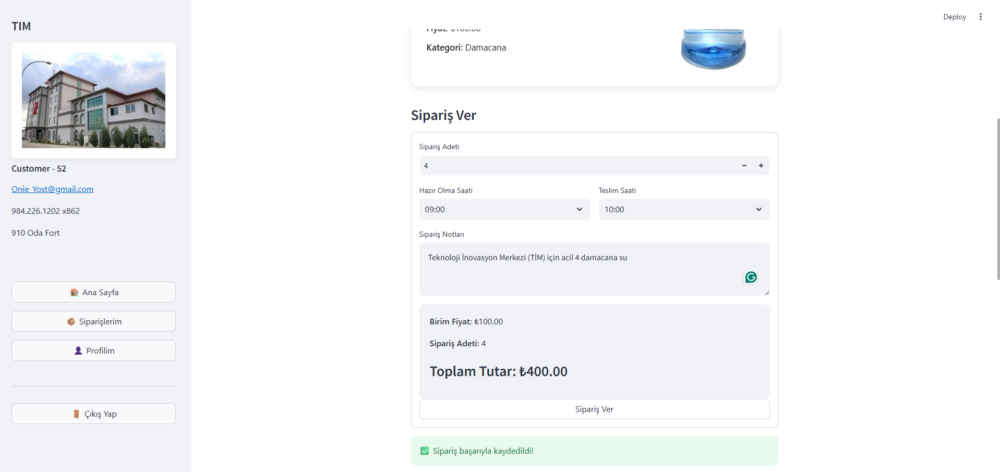
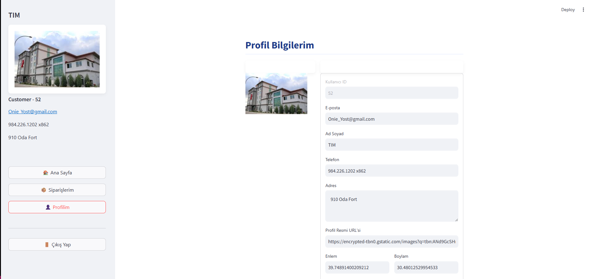
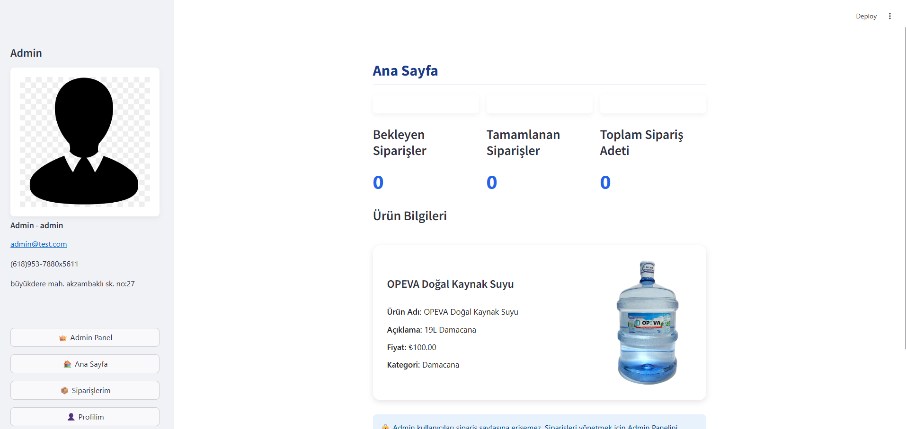
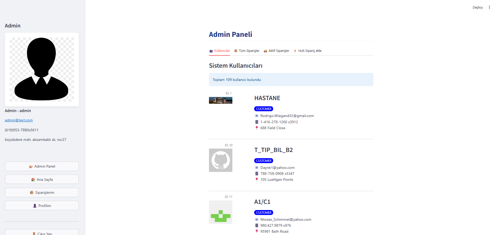
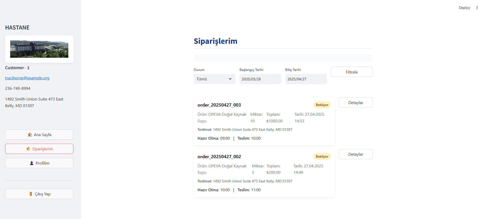

# OpevaSu - MongoDB Tabanlı Sipariş Yönetim Uygulaması

Bu uygulama, MongoDB veritabanı kullanarak kimlik doğrulama ve sipariş yönetimi işlemlerini gerçekleştiren bir Streamlit web ve React Native (Expo) mobil uygulamasıdır. Açık kaynaklı OPEVA projesinin bir parçası olarak geliştirilmektedir.

## Özellikler

- Kullanıcı kimlik doğrulama (MongoDB `users` koleksiyonu ile)
- Sipariş oluşturma ve kaydetme
- Tarih ve saat seçimi
- Yönetici (Admin) paneli üzerinden kullanıcı ve sipariş takibi
- Mobil uyumlu API ve cihaz uygulaması
- Rota planlama ve waypoint hesaplama aracı (Route Helper App)

---

## 🗺️ Route Helper App (Rota Harita Uygulaması)

Oluşturulan siparişlerin teslimat noktalarını harita üzerinden pratik bir şekilde seçip gerçek yollar üzerinden (OSRM destekli) rota oluşturmanızı sağlayan statik bir web aracıdır. Başlangıç, bitiş ve teslimat noktaları ekleyebilir, bu rotayı sistemin okuduğu özel `json` formatında dışarıya aktarabilirsiniz.

🌍 **Canlı Demo (GitHub Pages):** [https://pilestin.github.io/OpevaSu/helper_route_app/](https://pilestin.github.io/OpevaSu/helper_route_app/)

---

## Kurulum (Web Uygulaması)

1. Gerekli Python kütüphanelerini yükleyin:

```bash
pip install -r requirements.txt
```

2. MongoDB'nin kurulu ve çalışıyor olduğundan emin olun.

3. Örnek veritabanını kurun:

```bash
python setup_db.py
```

4. Uygulamayı çalıştırın:

```bash
streamlit run app.py
```

## Kullanım

- Giriş sayfasında kullanıcı ID'nizi girin (örn. "user1", "user2" veya "admin")
- Şifre alanına "123" yazın (Geliştirme süreci içindir)
- Giriş yaptıktan sonra sipariş adetini ve tarih/saati seçerek yeni sipariş oluşturabilirsiniz.

## Veritabanı Yapısı

- **users**: Kullanıcı bilgilerini içeren koleksiyon.
- **orders**: Sipariş bilgilerini içeren koleksiyon.

## Mobile Backend (Node.js)

Mobil istemci Python API yerine `mobile/backend/` servisine bağlanır.

Ortam değişkenleri (`mobile/backend/.env`):
- `MONGODB_URI`
- `MONGO_DB_NAME`
- `JWT_SECRET`
- `JWT_EXPIRES_IN`

Çalıştırmak için:
```bash
cd mobile/backend
npm install
npm run dev
```

Mobil app ve mobile backend ortak olarak repo kökündeki `.env` dosyasını kullanır:
- `EXPO_PUBLIC_API_BASE_URL=http://127.0.0.1:3001`
- `EXPO_PUBLIC_FLEET_VEHICLES_URL=http://127.0.0.1:3001/api/vehicles/locations/fiware`
- `REMOTE_FLEET_API_BASE_URL=http://127.0.0.1:3001/api`

## Geliştirme Notları

- Bu uygulama demonstrasyon amaçlıdır ve gerçek ortamda kullanılmadan önce güvenlik iyileştirmeleri yapılmalıdır.
- Şifre doğrulaması şu anda basit bir kontrol ile yapılmaktadır, gerçek uygulamalarda hash ve tuz kullanılmalıdır.

---

## Uygulama Görselleri 

<h3>Web Uygulama Görselleri</h3>

<div style="display: flex; flex-wrap: wrap; gap: 16px; justify-content: start;">
  <div style="flex: 0 0 48%;">
    
    <p style="text-align:center; font-size:14px;">Giriş Sayfası</p>
  </div>
  <div style="flex: 0 0 48%;">
    
    <p style="text-align:center; font-size:14px;">Ana Sayfa</p>
  </div>
  <div style="flex: 0 0 48%;">
    
    <p style="text-align:center; font-size:14px;">Sipariş Oluşturma</p>
  </div>
  <div style="flex: 0 0 48%;">
    
    <p style="text-align:center; font-size:14px;">Sipariş Oluşturma 2</p>
  </div>
  <div style="flex: 0 0 48%;">
    
    <p style="text-align:center; font-size:14px;">Profil Bilgileri</p>
  </div>
</div>

<h3>Admin Sayfaları</h3>

<div style="display: flex; flex-wrap: wrap; gap: 16px; justify-content: start;">
  <div style="flex: 0 0 48%;">
    
    <p style="text-align:center; font-size:14px;">Admin Sayfası</p>
  </div>
  <div style="flex: 0 0 48%;">
    
    <p style="text-align:center; font-size:14px;">Kullanıcı Listesi</p>
  </div>
  <div style="flex: 0 0 48%;">
    
    <p style="text-align:center; font-size:14px;">Sipariş Listesi</p>
  </div>
</div>
